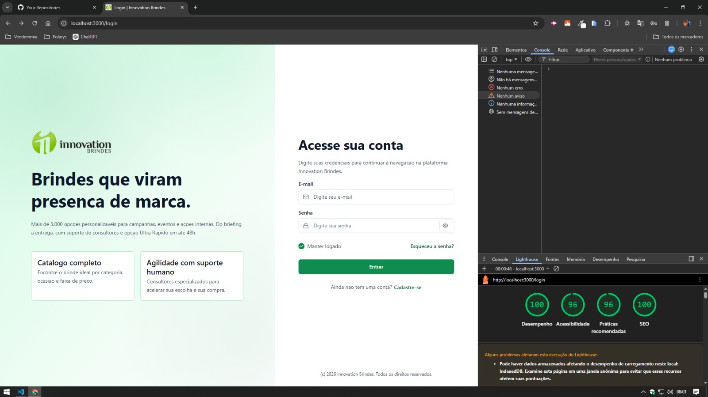
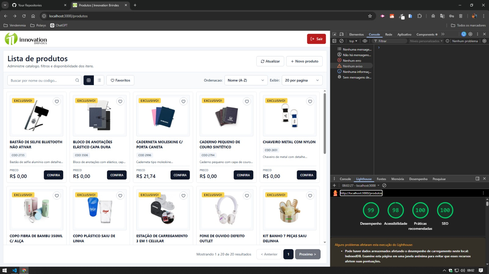

# Innovation Brindes - Teste Pratico Front-end

Mini aplicacao em `Next.js` (`App Router`) com rotas `/login` e `/produtos`, autenticacao via Bearer token e consumo da API homologada.

## Stack
- Next.js + TypeScript
- Zustand
- TanStack React Query
- Tailwind CSS
- Middleware para rotas protegidas
- Code splitting (`dynamic import` do modal)
- Docker
- Vitest + React Testing Library
- Playwright

## Estrutura de pastas
```text
src/
  app/
  components/ui/
  services/api/
  hooks/
  store/
  lib/
```

## Variaveis de ambiente
Use `.env` baseado em `.env.example`:

```bash
API_BASE_URL=https://apihomolog.innovationbrindes.com.br
NEXT_PUBLIC_API_BASE_URL=https://apihomolog.innovationbrindes.com.br
NEXT_PUBLIC_IMAGE_HOST=innovationbrindes.com.br
```

Opcional para Playwright:

```bash
E2E_LOGIN_EMAIL=dinamica
E2E_LOGIN_PASSWORD=123
PLAYWRIGHT_PORT=3100
```

## Rodar local
```bash
npm install
npm run dev
```

Build e execucao de producao:
```bash
npm run build
npm run start
```

## Rodar com Docker
Build e run:
```bash
docker build -t innovation-brindes-web .
docker run --rm -p 3000:3000 --env-file .env innovation-brindes-web
```

Com Docker Compose:
```bash
docker compose up --build
```

## Testes
Unitarios (Vitest + RTL):
```bash
npm run test
```

Smoke E2E (Playwright):
```bash
npx playwright install chromium
npm run test:e2e
```

Lint:
```bash
npm run lint
```

## Endpoints usados
Base URL: `https://apihomolog.innovationbrindes.com.br`

- `POST /api/innova-dinamica/login/acessar`
  - Body: `{"email":"dinamica","senha":"123"}`
- `GET /api/innova-dinamica/produtos/listar` (Bearer token)
- `POST /api/innova-dinamica/produtos/listar` (Bearer token)
  - Body: `{"nome_produto":"","codigo_produto":""}`

## Decisoes tecnicas
- `authStore` com `token`, `user`, `isAuthenticated` e actions `loginSuccess`, `logout`, `hydrateFromStorage`.
- `manter logado`:
  - marcado: persiste em `localStorage` + cookie com `expires` de 7 dias;
  - desmarcado: persiste em `sessionStorage` + cookie de sessao.
- Token tambem vai para cookie `auth_token` para o middleware proteger `/produtos`.
- Tradeoff de seguranca: cookie client-side (nao `HttpOnly`) por ausencia de backend proprio no teste.
- `apiClient` central injeta Bearer automaticamente e trata `401` com logout forcado + redirect para `/login`.
- Busca debounced (1000ms) com `POST` filtrado por nome/codigo.
- Ordenacao local no client por nome (A-Z/Z-A) e preco (asc/desc).
- Paginacao local com selecao de itens por pagina.
- Toolbar responsiva: no mobile, ordenacao e quantidade ficam em popover de filtros.
- Favoritos em `localStorage` via `zustand/persist`.
- Logout remove apenas dados de autenticacao (sem limpar todo o storage do navegador).
- Modal acessivel com `role="dialog"`, `aria-modal`, `aria-labelledby`, `aria-describedby`, foco de retorno e fechamento por `Esc`.

## SEO e acessibilidade
- Metadata definida em `/login` e `/produtos` (`title` + `description`).
- Labels associados em inputs principais.
- Imagens com `alt`.
- Foco visivel em elementos interativos.

## Evidencias da entrega
- Lighthouse desktop (capturado em 23/02/2026):
  - Login: `docs/lighthouse-desktop-login.png`
  - Produtos: `docs/lighthouse-desktop-produtos.png`


